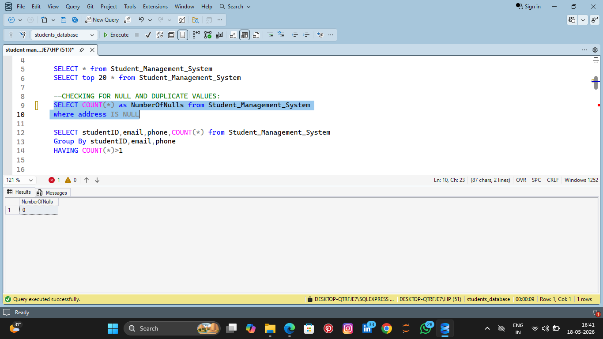
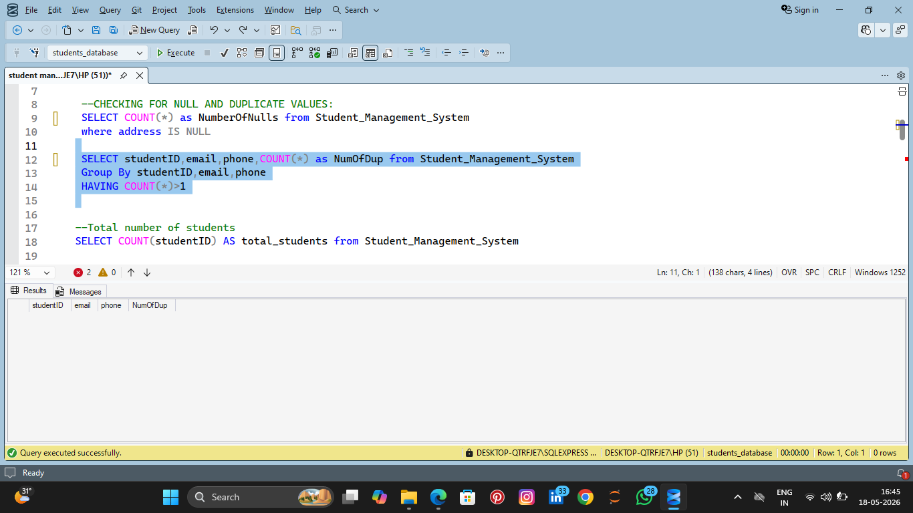
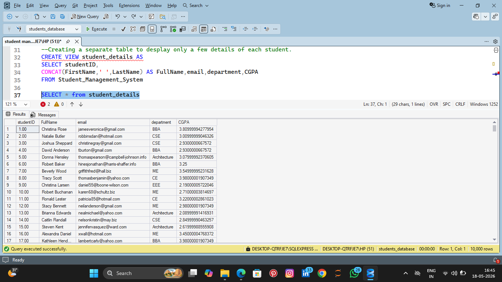
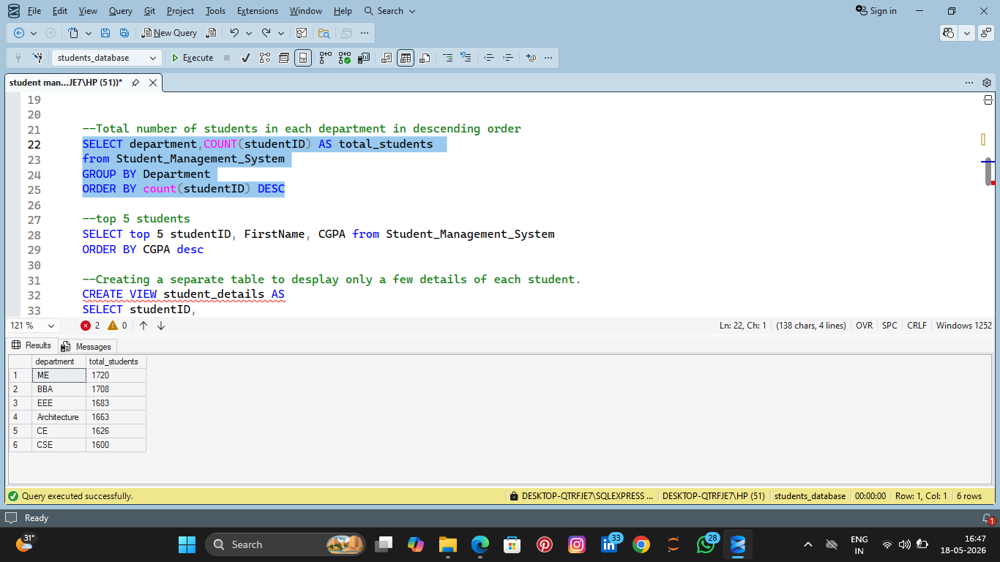

# Student Management System (SQL)

## 📌 Project Overview

This project is a SQL-based Student Management System developed using SQL Server. The dataset was imported from a CSV file and analyzed using SQL queries to perform data validation, database operations, and generate insights.

## 📊 Tools Used

- SQL
- SQL Server
- CSV Dataset

## 🔍 Key Features

- Imported CSV dataset into SQL Server
- Checked null and duplicate values
- Created SQL views
- Performed analysis using SQL queries
- Generated meaningful insights

## 📁 Files

- Student_Management_System.csv → Original dataset
- student_management_system.sql → SQL project file
